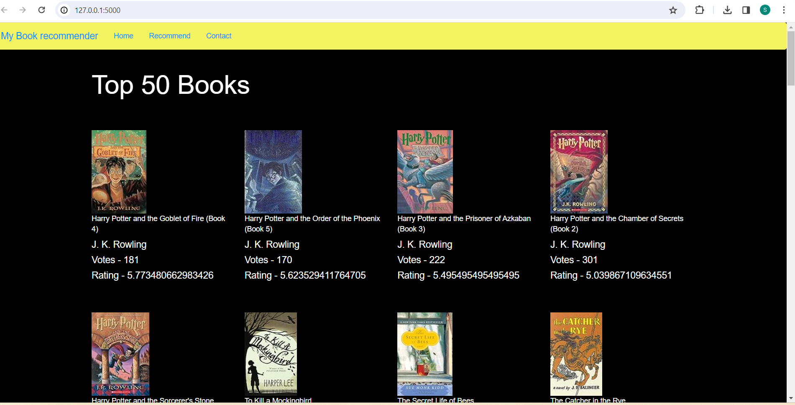

# Book Recommendation System

*Figure : The home page displaying the top 50 books based on popularity.*

## Overview
The Book Recommendation System is a Flask-based web application that offers two main features:

### Popularity-Based Recommendation
The home page displays the top 50 books based on popularity, selected based on their average rating and at least 150 reviews. This ensures that the recommended books are widely loved and have a substantial number of ratings.

### Personalized Recommendation
In the "Recommend" tab, users can input a book title they are interested in. The system utilizes two recommendation algorithms - Cosine Similarity and Collaborative Filtering - to suggest four similar books. Cosine Similarity compares book similarities based on their features, while Collaborative Filtering recommends books based on similar user preferences.

## How to Use
1. Clone the repository to your local machine.
2. Install the required dependencies.
3. Run the Flask app using `python app.py`.
4. Access the web app in your browser by navigating to [http://localhost:5000](http://localhost:5000).

## Features
- **Top 50 Books**: Display a curated list of the top 50 books based on popularity and user ratings.
- **Personalized Recommendations**: Receive personalized book recommendations by entering a book title of interest.
- **Cosine Similarity and Collaborative Filtering**: Utilize advanced recommendation algorithms for accurate and relevant book suggestions.

## Technologies Used
- Python
- Flask
- Pandas 2.2.1
- Scikit-learn

## Acknowledgements
Special thanks to Kaggle for providing the book dataset used in this project.

